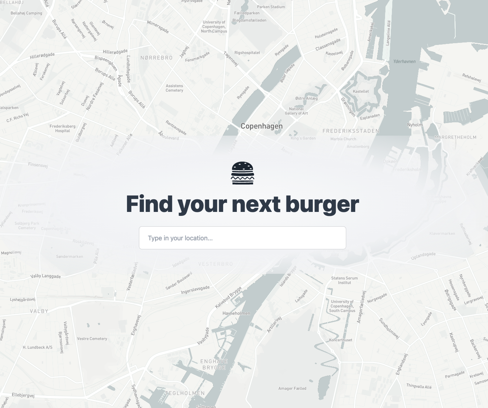

# Burger

Burger place finder - check restaurants in your area

[Demo link](https://burger-royserg.vercel.app/)

## Tech:

- Next.JS
- TailwindCSS
- MapBox
- Google Maps API

## Overview:

## Run the project:

### Prerequisites:

- Create MapBox account and generate API token: [mapbox account](https://account.mapbox.com/)
- Create GoogleMaps API token: [google cloud credentials](https://console.cloud.google.com/projectselector2/google/maps-apis/credentials)

- add both tokens into `.env.local.example` and rename file to `.env.local` (remove '.example')

### Install dependencies

Run:

- `npm/pnpm install`

### Run the app

- `npm run dev / pnpm dev`

- open webpage on `localhost:3000`
